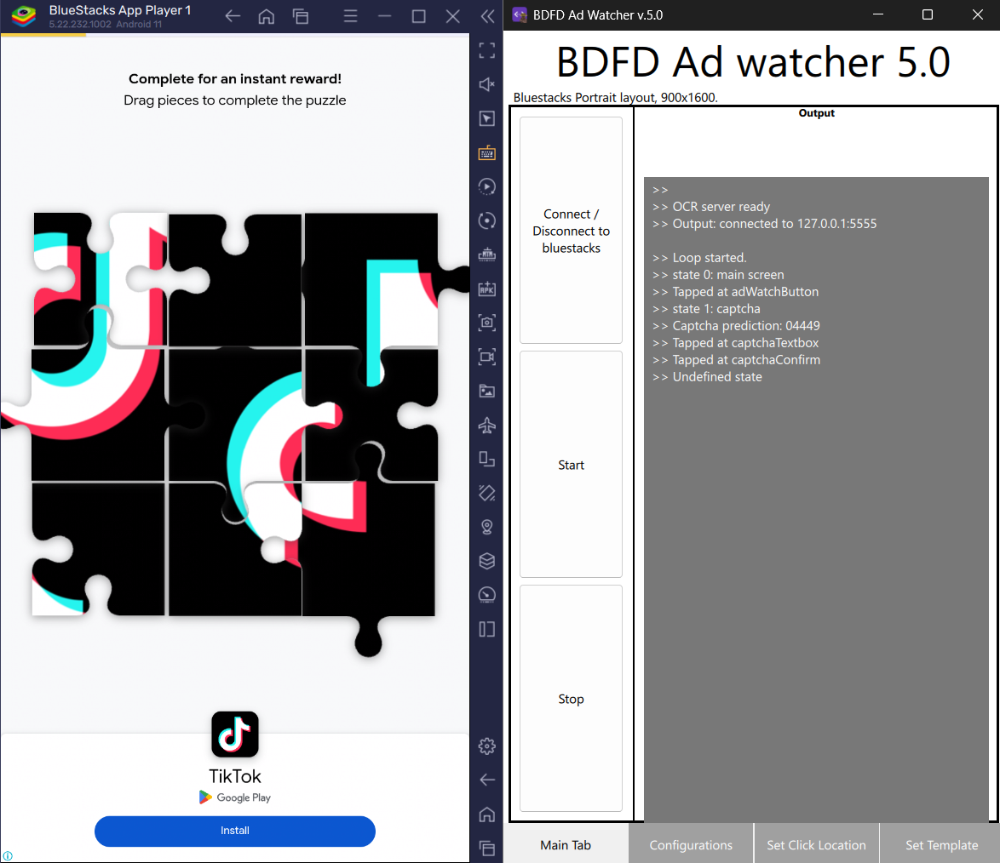
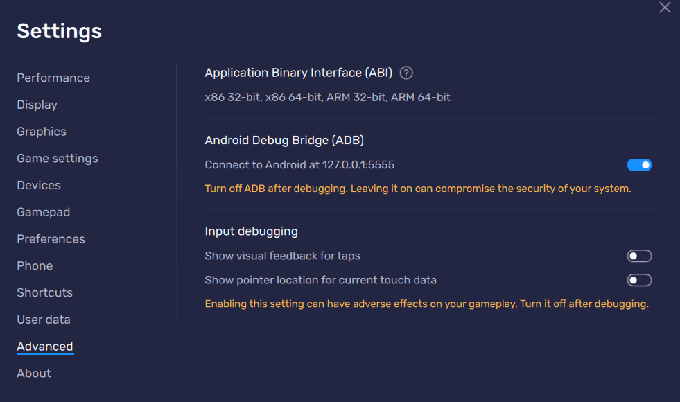
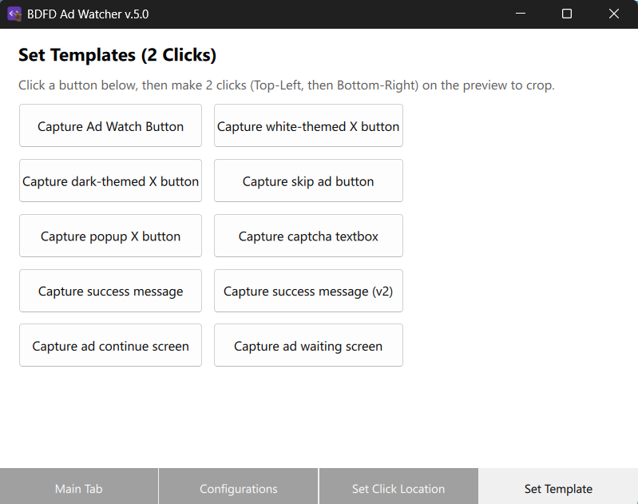

# BDFD Ad watcher
There's an app, an organization, a language, called BDFD, aka, Bot Designer For Discord. Their mobile app lets us host discord bots for free in exchange for watching ads.
So I made this macro that watches the ad for me 😀.

### Requirements
* Runs on **Windows**.
* Uses **Bluestacks** emulator (running the BDFD app downloaded from Google Play Store).

## Installation
1. Go to [BDFD Ad Watcher v5.0](https://github.com/phivogit/BDFD_Ad_Watcher/releases/latest) and download the `.exe` file.
2. Run the file, follow the setup wizard to complete setting up the app.
3. In Bluestacks, go to **Settings** > **Advanced** and enable **Android Debug Bridge (ADB)** to allow connecting to Android.

> [!NOTE]
> * **Startup Time**: It takes about 15 seconds to load up because the Python OCR server is initializing in the background.
> * **Permissions**: On the very first run, Bluestacks will ask for USB debugging permission. Make sure to check **"Always allow from this computer"** so the app can connect silently in the future.

## Usage
1. Open Bluestacks, open BDFD app, click on your bot.
3. Make sure you don't scroll down, go to BDFD Ad Watcher app, click **Connect to bluestacks**, then click **Start**.
4. To stop the program, click **Stop**.

## How to Configure Settings
The app includes configuration tabs to map button coordinates and change templates if your Bluestacks screen layout / BDFD UI differs from the default template.

### Setting Coordinates & Templates
* **Set Location Buttons (1 Click)**:
  Used to set the coordinates for clicking buttons (e.g. X Close button, Ad Watch button). Click the button on the configuration tab, then make a **single click** on the corresponding pixel on the emulator preview.
* **Template Saving Buttons (2 Clicks)**:
  Used to capture image templates of buttons and screens to detect application states. Click the save button on the configuration tab, then make **two clicks** on the emulator preview:
  1. First click: **Top-Left** corner of the button.
  2. Second click: **Bottom-Right** corner of the button.
  **Note that I forgot to add the saving template code, so the templates will reset to the defaults every time you close the app**

### File & Settings Locations
* **Default Settings**: Hardcoded as defaults inside [backend.h](file:///d:/Hi/CD/Github_repos/BDFDAdW/backend.h).
* **Saved Settings File**: Saved permanently on your C drive at `C:\Users\<Username>\AppData\Local\appBDFDAdW\settings.json`.
* **Templates Folder**: Saved relative to the executable at `./templates`.
